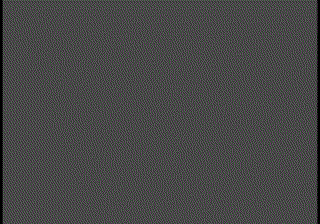

<h2> 𝐇𝐞𝐥𝐥𝐨 𝐭𝐡𝐞𝐫𝐞, 𝐟𝐞𝐥𝐥𝐨𝐰 <𝚍𝚎𝚟𝚎𝚕𝚘𝚙𝚎𝚛𝚜/>! </h2>

You have finally discovered my Github profile.  
Please feel free to clone/fork projects, raise issues and submit Problems if you think something could be better.  
Ask me anything <a href="https://github.com/sanikava/sanikava/issues/new"><b>here</b></a> 
or <a href="mailto:sanikava@mailindia.cf"><b>email</b></a> me.

<i>Happy Coding Dear Friends!</i> 😊

 

<i>Random dev joke for you!</i> 

 
<!--  -->

 
<i>Follow me around the web:</i> 

